# SSD Migration

## Hardware used

- Raspberry Pi 5
- Raspberry Pi SSD Kit
  - Official Raspberry Pi M.2 HAT+
  - Raspberry Pi 2230 SSD 512 GB NVMe SSD
- SanDisk Extreme 64 GB microSD card

## Raspberry Pi SSD Kit Installation

1. Package
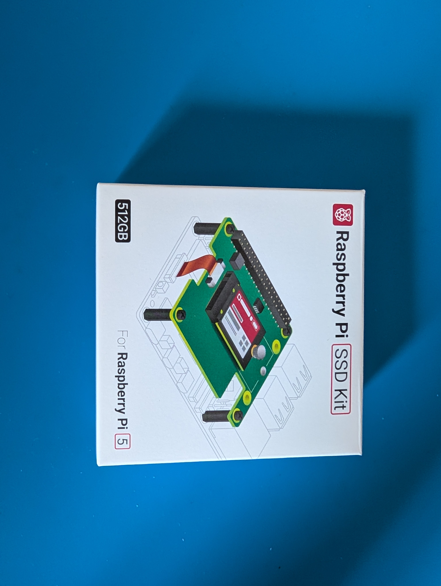

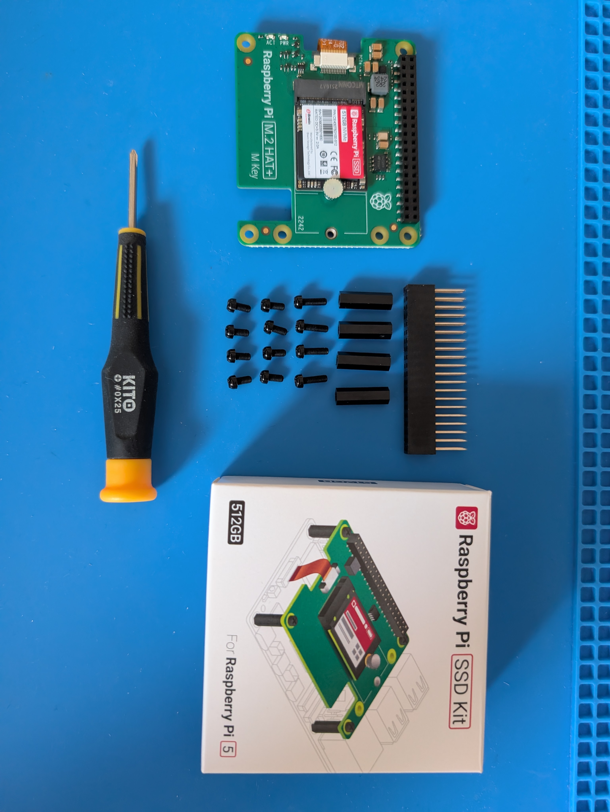
2. Preparing PCIe flex kabel

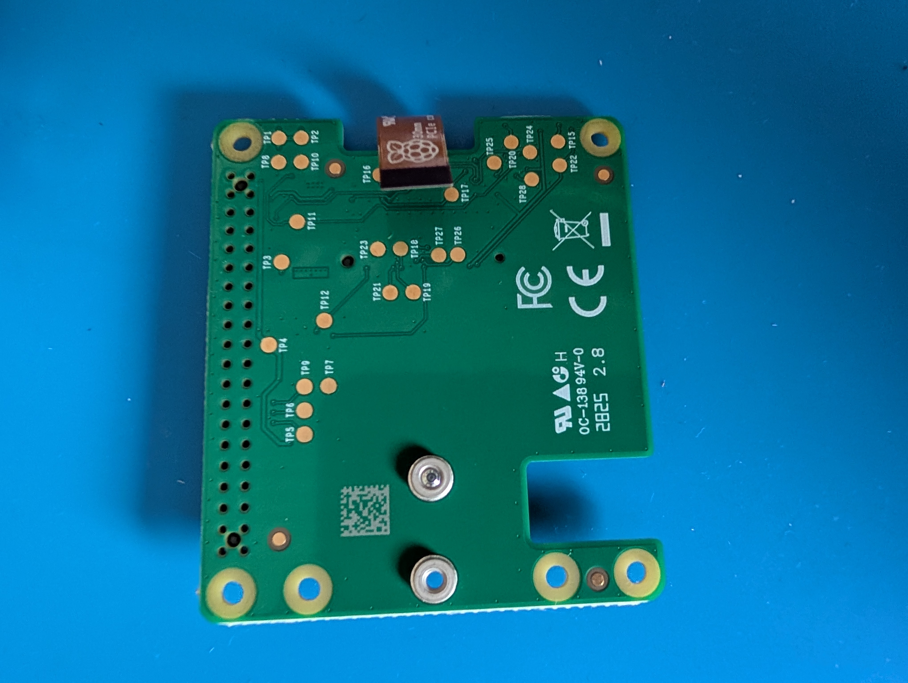
3. Preparing PCIe connector

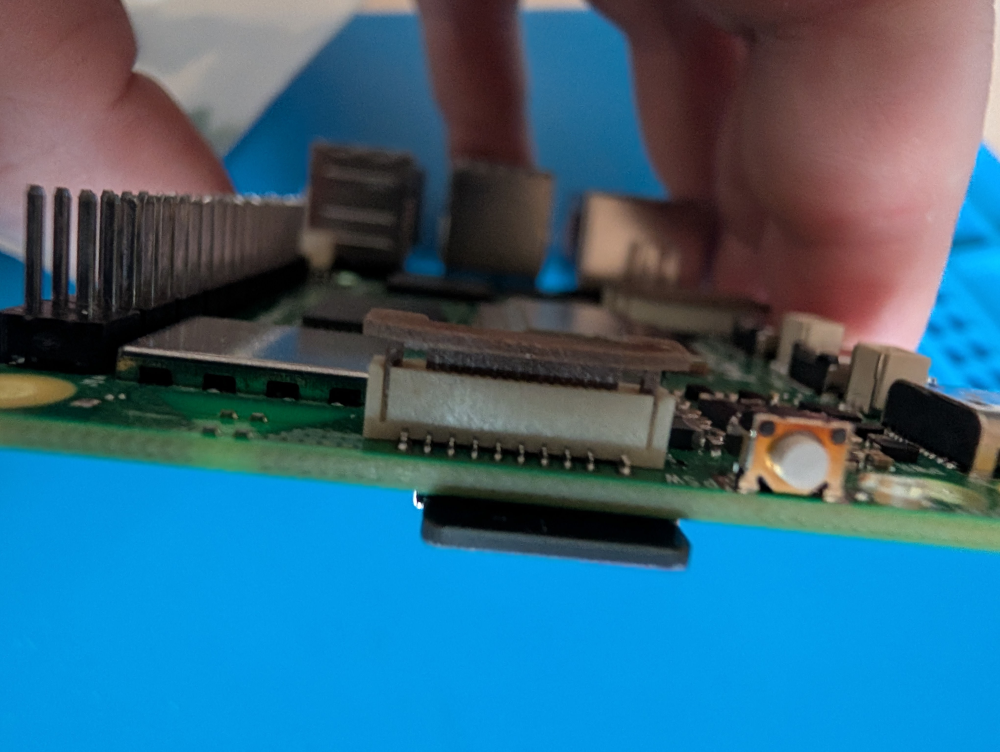
4. Installed the GPIO stacking header between the Raspberry Pi 5 and SSD HAT.
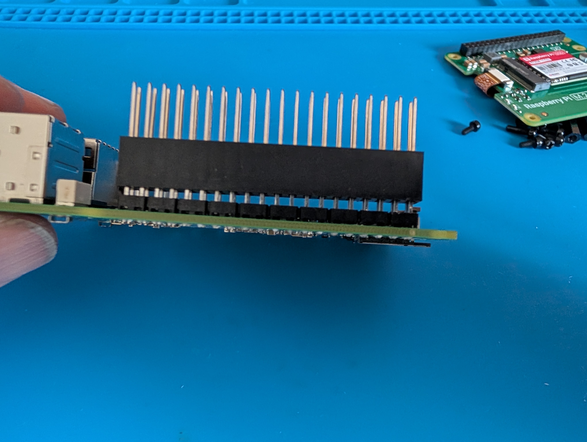
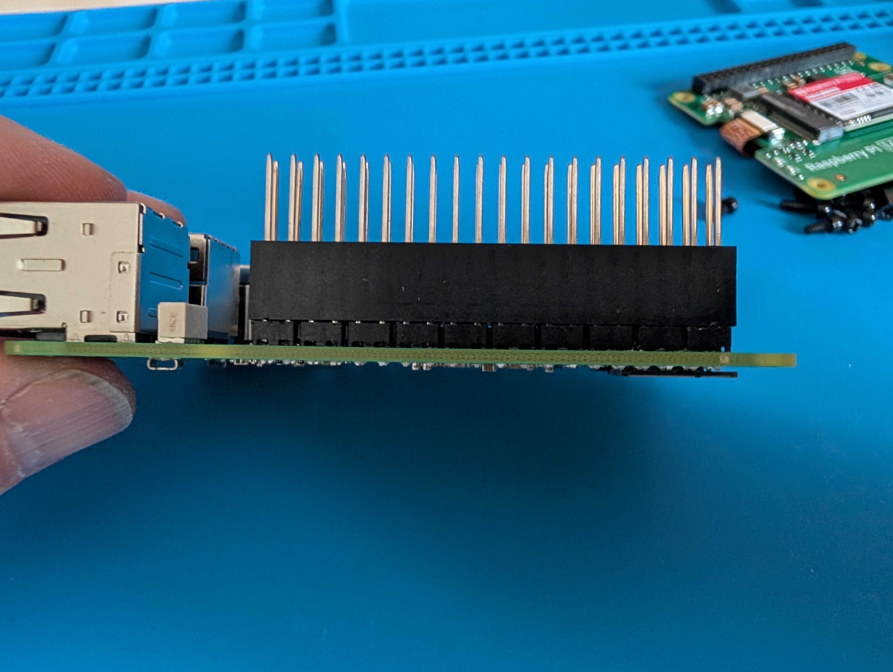
5. Installed the metal standoffs between the Raspberry Pi 5 and SSD HAT.
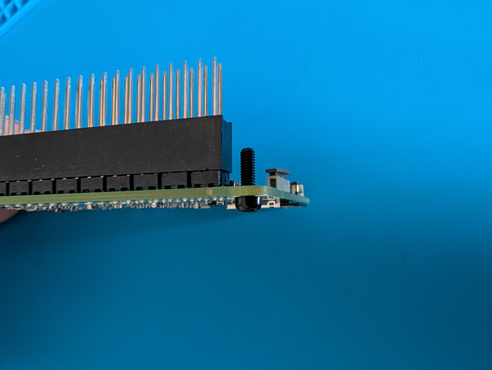
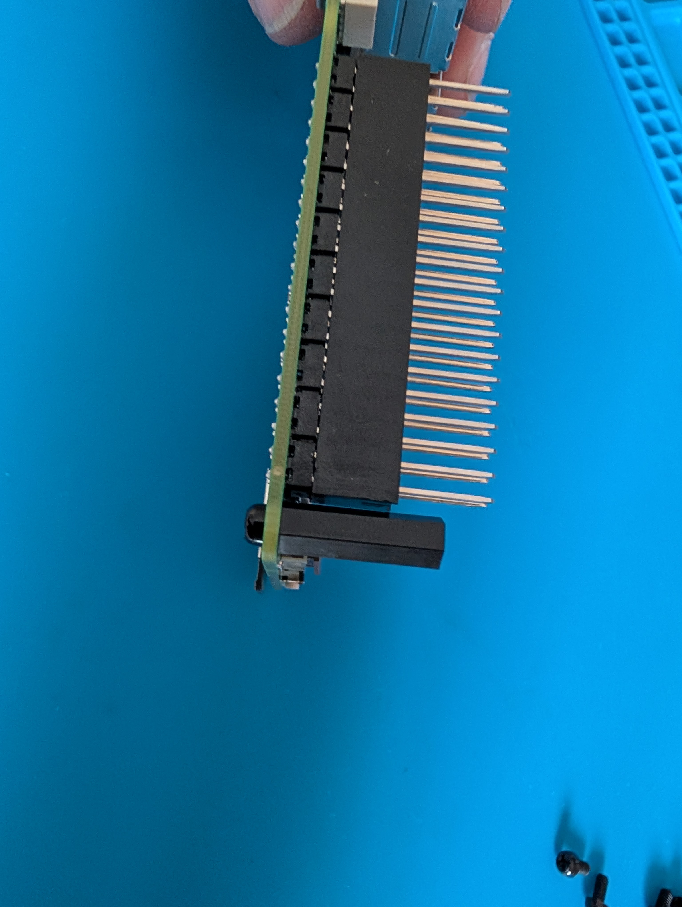
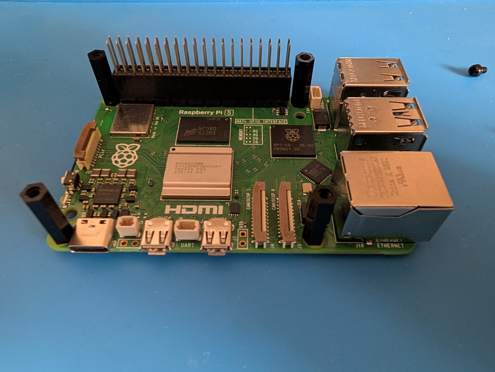
6. Connected the PCIe ribbon cable between Raspberry Pi 5 and SSD HAT.

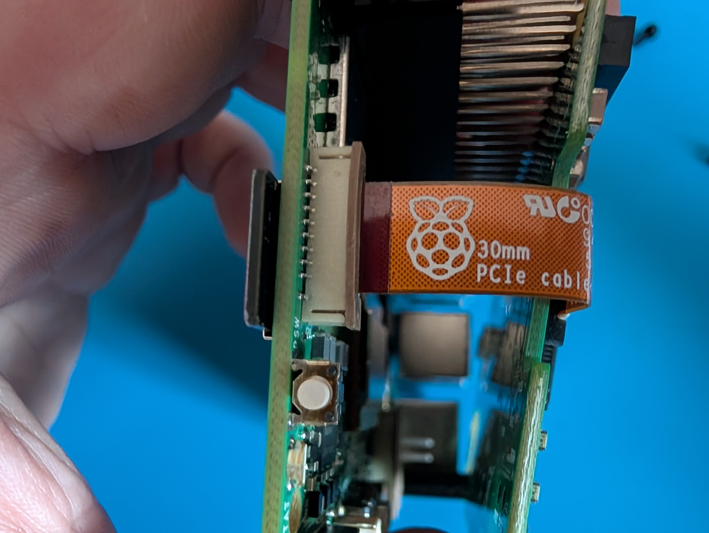
7. Mounted the SSD HAT onto the GPIO stacking header.
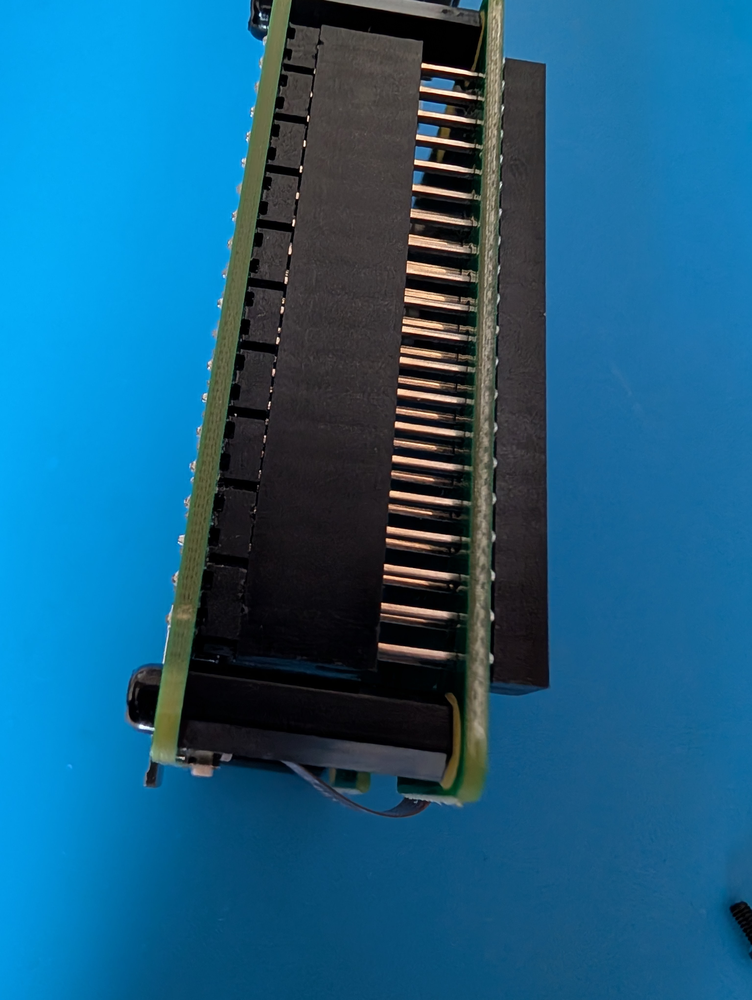
8. Mounted and secured the SSD HAT using screws and standoffs.
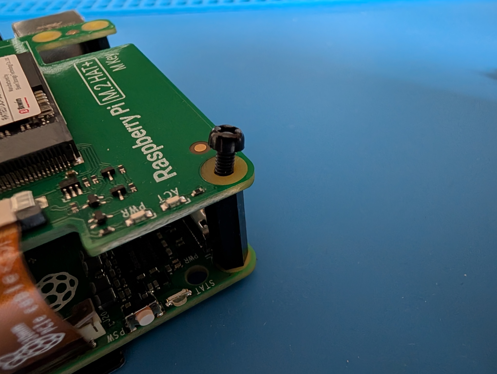
9. Done!

## Installation process

1. Shutdown Home Assistant
2. Installed Raspberry Pi SSD HAT
3. Connected ribbon cable
4. Mounted NVMe SSD
5. Booted Home Assistant

## Home Assistant migration

1. Opened:
   Settings → System → Storage

2. Selected:
   Move data disk

3. Selected NVMe SSD

4. Started migration process
   - approximately 10 minutes

5. Waited for reboot and migration completion

## Result

- Home Assistant successfully migrated data to NVMe SSD
- System is running correctly
- Dashboard, Zigbee2MQTT and automations are working

## Current status

- Raspberry Pi still requires SD card for boot
- Home Assistant data is running from NVMe SSD
- Full NVMe boot without SD card will be solved later

## Future plan

- Create full Home Assistant OS installation directly on NVMe SSD
- Restore backup from current system
- Remove SD card completely
